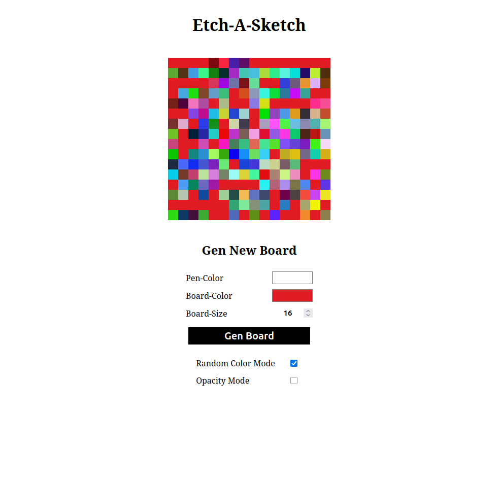
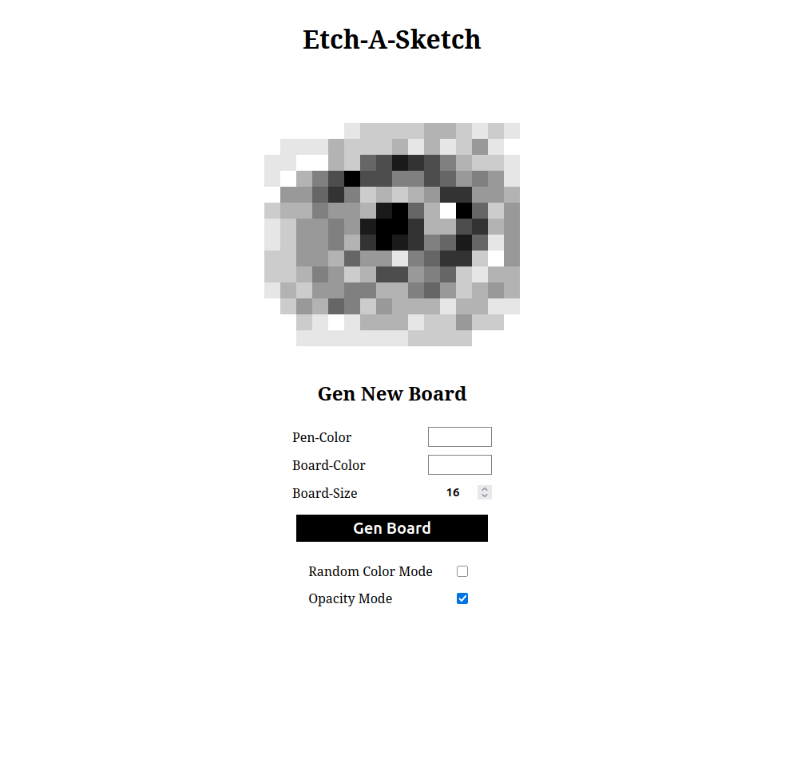

[Back](../../README.md)
# Paint
This is a variation of a etch a sketch game.

The board is build with divs acting like pixels.
The player can paint on that board by just hoovering over it.

## Final Design

### Random Color Mode

### Opacity Mode

