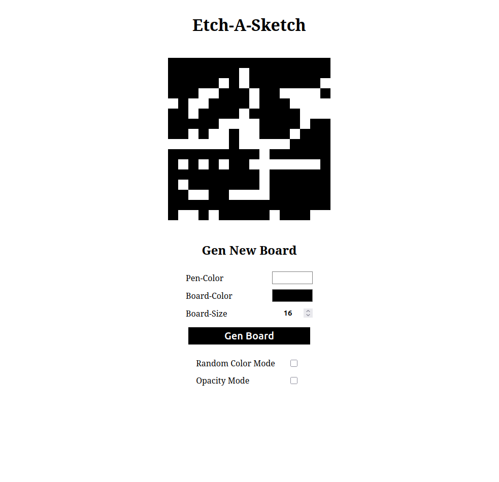
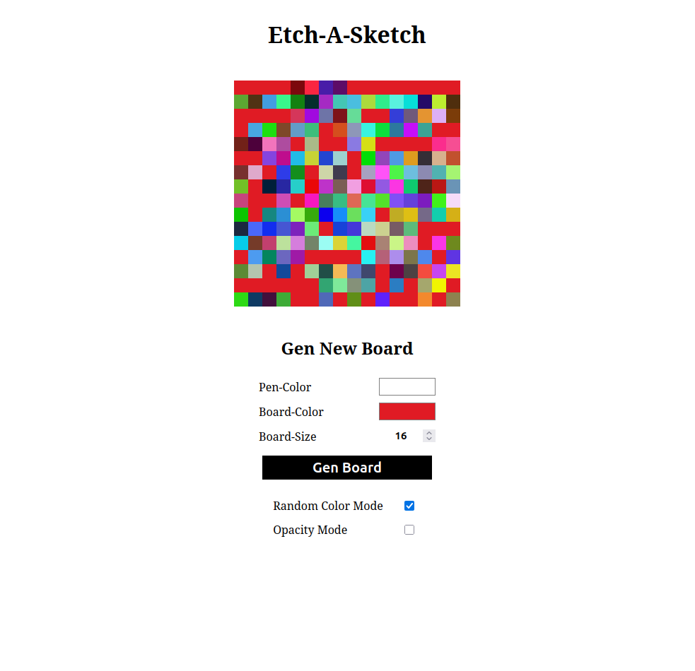
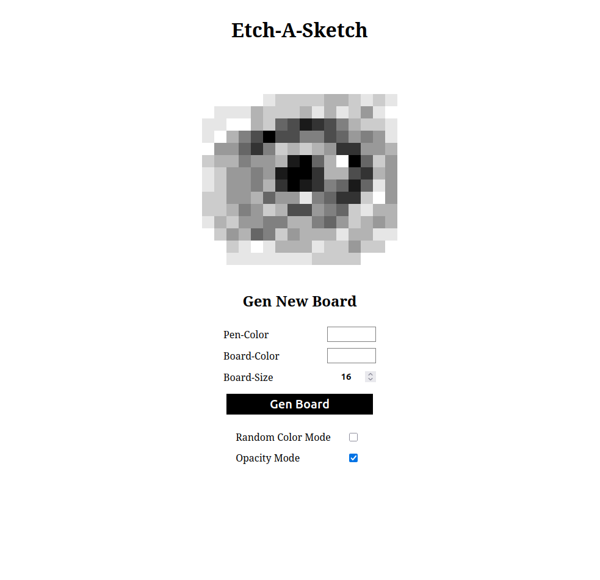

# Etch-a-sketch - A-Paint-Game
This is a variation of the etch a sketch game.

The board is build with divs acting like pixels.
The player can paint on that board by just hoovering over it.

## Final Design

### Random Color Mode

### Opacity Mode

